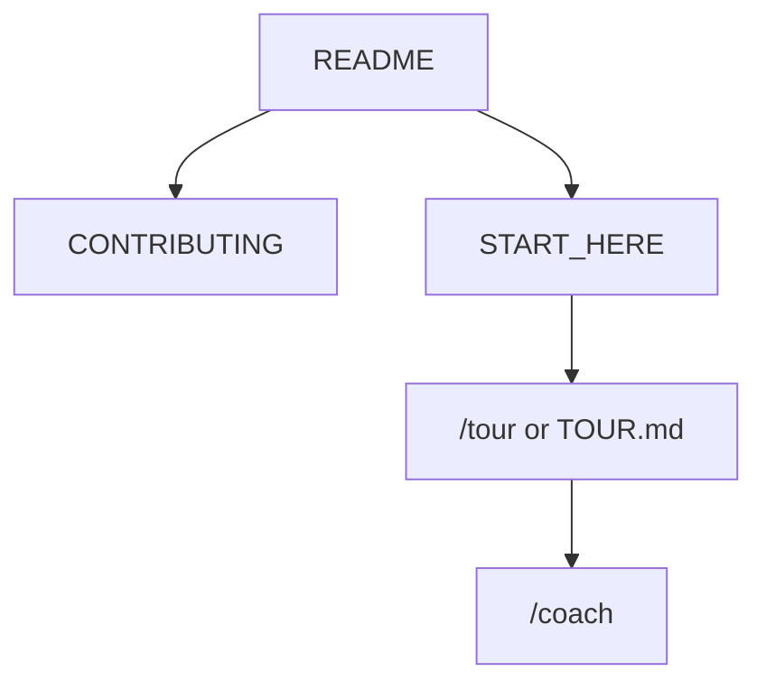

<!-- GENERATED by scripts/generate-project-readme.py — edit branding/product.json -->

  

<h1 align="center">JanusBoot</h1>

<strong>UEFI-first graphical boot manager (Limine + ESP settings + janusbootctl)</strong>

  
  
  
  
  
  
  
  
  
  
  
  

  

## Pitch

JanusBoot is a UEFI-first graphical boot manager that feels like BURG, scans like rEFInd, and stores one settings/theme contract on the ESP that you can change from the boot menu, from Linux, and from Windows. Engine: Limine. CLI: janusbootctl. Layout: EFI/JanusBoot/.

## Demo

  

> Add screenshots or a short demo GIF under `docs/images/` and link them here when available.

## Features

- Limine-backed UEFI boot UI with BURG-inspired themes and last-used timeout
- Single ESP JSON contract for settings, entries, and themes
- janusbootctl for validate, get/set, backup, and limine.conf generation
- QEMU+OVMF first; Linux and Windows desktop tools talk only to the CLI
- Repair and scanner flows planned without forking unmaintained bootloaders

## Quick start

1. Read AGENT.md and docs/JANUSBOOT_AGENT_LANES.md before any lane work.
2. Cloud lane owns schemas/CLI; Local lane owns Makefile/QEMU — see .cursor/janusboot-lane-lock.json.
3. After cloud merge into local/phase-0-2: make validate, make esp-image, make qemu.

## For humans

Start with this README, then [`CONTRIBUTING.md`](CONTRIBUTING.md) and [`docs/BEST_PRACTICES.md`](docs/BEST_PRACTICES.md). The first-month playbook is [`docs/FIRST_30_DAYS.md`](docs/FIRST_30_DAYS.md).

## For agents

Read [`docs/START_HERE.md`](docs/START_HERE.md) and [`AGENTS.md`](AGENTS.md). In Cursor type `/tour` or `/bootstrap`. Any other IDE: ask the agent to read [`docs/help/TOUR.md`](docs/help/TOUR.md). `/coach` is the next recommended action.

## Install

Python 3.11+ with uv for examples/python (janusbootctl). Host tools for Local lane: qemu-system-x86_64, OVMF, dosfstools/mtools. See modules/python/MODULE.md and docs/qemu.md (Local). Real-machine read-only scan: docs/host-dry-run.md (`make host-dry-run`).

## Usage

Use /coach for the next BUILD_PLAN row. Cloud agents work only on cloud/*; local agents on local/*. Never edit the other lane’s exclusive paths.

## Configuration

Copy [`.env.example`](.env.example) to `.env` for local secrets (never commit `.env`). Stack-specific config lives in the active `examples/` or app root after prune.

## Contributing

See [`CONTRIBUTING.md`](CONTRIBUTING.md). Prefer small PRs; follow Conventional Commits and the BUILD_PLAN labels (`AGENT` / `HUMAN` / `ADB` / `AUTO`). Status markers: 🔲 open · ✅ done · ❌ blocked.

## Security

See [`SECURITY.md`](SECURITY.md). Enable Dependabot alerts and follow [`docs/SECURITY_TRIAGE.md`](docs/SECURITY_TRIAGE.md) for weekly CVE triage.

## License

[MIT License](LICENSE) — see the license file for terms.

## Acknowledgments

Scaffolded with [agent-project-bootstrap](https://github.com/edwardlthompson/agent-project-bootstrap). Brand assets: [`branding/BRANDING.md`](branding/BRANDING.md). Design system: [`docs/DESIGN_GUIDE.md`](docs/DESIGN_GUIDE.md).
