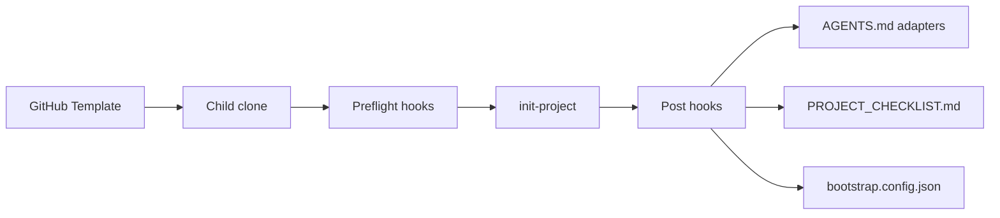

# Product Specification

> Spec-driven development stub. Fill after `init-project`. Feature slices still use `docs/features/{name}.md`.
> Status markers: 🔲 open · ✅ done · ❌ blocked.

## Overview

<!-- product-brief-sync:begin -->
_Template maintainer: no product AGENT.md. Children write AGENT.md before init._
<!-- product-brief-sync:end -->

**Product:** agent-project-bootstrap
**Purpose:** GitHub Template Repository that bootstraps FOSS projects with Cursor-ready agent routing, CI, and Golden Path examples.
**Users:** Humans and AI agents initializing or maintaining a child repo. Read `AGENT.md` on a child before Golden Path About/donate work.

## Functional Requirements & User Stories

| ID | Story | Acceptance |
|----|-------|------------|
| FR-1 | As a maintainer I run `scripts/init-project.sh` so the child repo is customized | Manifest, adapters, and checklist exist; unused stacks prune when asked |
| FR-2 | As an agent I read `AGENTS.md` first so I follow architecture and test-first rules | Adapters for Cursor, Claude Code, and Copilot stay in sync |
| FR-3 | As a reviewer I get CI + security on every PR without opting in | `ci.yml`, `security.yml`, Dependabot, issue/PR templates present |

## Non-Functional Constraints

- MIT default (Apache-2.0 selectable at init for child repos)
- No proprietary SDKs on the FOSS production path
- Opt-in telemetry only; never enabled by default
- File budgets: 300 lines static data, 150 lines pure logic
- Preflight fails clearly when `git` or Python is missing

## Architecture & Data Flow

## Test-first rule

Every feature in `docs/plan.md` / BUILD_PLAN must list tests, or state why automation is not feasible and name the fallback command.
