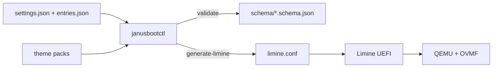

# Product Specification — JanusBoot

> Status markers: 🔲 open · ✅ done · ❌ blocked.
> Read `AGENT.md` before any BUILD_PLAN sprint row.

## Overview

<!-- product-brief-sync:begin -->
> Read `AGENT.md` before any sprint row.

**One-liner:** A UEFI-first graphical boot manager that feels like BURG, scans like rEFInd, can repair a broken OS path like Super GRUB, and stores one settings/theme contract on the ESP that you can change from the boot menu, from Linux, and from Windows.
**Do not drift:** limine, uefi, janusbootctl, efi/janusboot, qemu, ovmf
<!-- product-brief-sync:end -->

**Product:** JanusBoot  
**CLI:** `janusbootctl`  
**ESP root:** `EFI/JanusBoot/`  
**Stack:** Python (CLI + schemas); Limine UEFI loader; QEMU+OVMF for boot tests  
**Users:** Dual-boot Linux/Windows owners who want one graphical boot UI and one
settings contract editable from EFI, Linux, and Windows.

## Functional Requirements (Phase 0–2)

| ID | Story | Acceptance |
|----|-------|------------|
| FR-1 | As an agent I validate ESP JSON against schemas | `janusbootctl validate` exits 0 on fixtures; fails on invalid docs |
| FR-2 | As a user I get/set settings keys without hand-editing | `get` / `set` round-trip; schema still valid |
| FR-3 | As a user I backup settings before changes | `backup` copies into `EFI/JanusBoot/backup/` |
| FR-4 | As the build I generate Limine conf from JSON | Golden `limine.conf` matches fixtures (timeout, default, two entries, wallpaper) |
| FR-5 | As LOCAL I smoke two fake entries in QEMU | After cloud merge: `make qemu` shows Windows 11 + Linux Mint |

## Phase 3+ CLI surface

| Command | Role |
|---------|------|
| `scan` | Heuristic EFI discovery → entries JSON (`source: scanned`) |
| `repair-plan` | Dry-run repair steps (Janus files, bootmgfw backup, NVRAM) |
| `theme-preview` / `theme-apply` | Validate + copy theme packs (data only) |

## Windows GUI structure (Phase 6 — mocks)

C# / WinUI 3 outline (docs-only until Windows host work):

```
src/JanusBoot.WinUI/
  App.xaml
  Views/EntriesView.xaml       # list/reorder; binds to janusbootctl get/scan
  Views/SettingsView.xaml      # timeout/default/theme via CLI
  Views/RepairView.xaml        # shows repair-plan JSON; confirm before apply
  Services/JanusBootCtlClient.cs  # ProcessStartInfo → janusbootctl.exe
  Services/Elevation.cs           # require admin; never silent ESP write
  Mocks/FakeEsp/                  # fixtures mirrored for designer
```

Elevation + BCD/`bootmgfw` dry-run stay LOCAL on a Windows host (`third_party/`
notes). Cloud ships this structure + mocks only.

## Non-Functional Constraints

- MIT; FOSS only on the production path
- Linux and Windows share schemas; divergence fails CI
- Theme assets: data only; size/path limits in `schema/theme.schema.json`
- Feature flags: `repair`, `mouse`, `secureboot` (off by default in fixtures)
- File budgets: 300 lines static data, 150 lines pure logic per module
- No real-disk `dd`; QEMU+OVMF for every boot change

## Architecture & Data Flow



## Schemas

| File | Role |
|------|------|
| `schema/settings.schema.json` | Timeout, default, theme, flags, wallpaper |
| `schema/entries.schema.json` | Boot entry list (id, title, path, type) |
| `schema/theme.schema.json` | Theme pack metadata + size/path limits |

## Test-first rule

Phase 0–2 CLI changes ship with pytest under `examples/python/tests/` (no QEMU).
QEMU acceptance is LOCAL after cloud merge.
