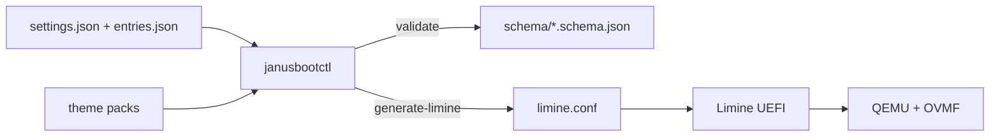

# Product Specification — JanusBoot

> Status markers: 🔲 open · ✅ done · ❌ blocked.
> Read `AGENT.md` before any BUILD_PLAN sprint row.

## Overview

<!-- product-brief-sync:begin -->
> Read `AGENT.md` before any sprint row.

**One-liner:** A UEFI-first graphical boot manager that feels like BURG, scans like rEFInd, can repair a broken OS path like Super GRUB, and stores one settings/theme contract on the ESP that you can change from the boot menu, from Linux, and from Windows.
**Do not drift:** limine, uefi, janusbootctl, efi/janusboot, qemu, ovmf
<!-- product-brief-sync:end -->

**Product:** JanusBoot
**CLI:** `janusbootctl`
**ESP root:** `EFI/JanusBoot/`
**Stack:** Python (CLI + schemas); Limine UEFI loader; QEMU+OVMF for boot tests
**Users:** Dual-boot Linux/Windows owners who want one graphical boot UI and one
settings contract editable from EFI, Linux, and Windows.

## Functional Requirements (Phase 0–2)

| ID | Story | Acceptance |
|----|-------|------------|
| FR-1 | As an agent I validate ESP JSON against schemas | `janusbootctl validate` exits 0 on fixtures; fails on invalid docs |
| FR-2 | As a user I get/set settings keys without hand-editing | `get` / `set` round-trip; schema still valid |
| FR-3 | As a user I backup settings before changes | `backup` copies into `EFI/JanusBoot/backup/` |
| FR-4 | As the build I generate Limine conf from JSON | Golden `limine.conf` matches fixtures (timeout, default, two entries, wallpaper) |
| FR-5 | As LOCAL I smoke two fake entries in QEMU | After cloud merge: `make qemu` shows Windows 11 + Linux Mint |
## Phase 3+ / Must-gap CLI surface

| Command | Role |
|---------|------|
| `scan [--shallow]` | Heuristic + recursive EFI discovery → entries JSON |
| `repair-plan` / `repair-apply` / `repair-undo` | Plan + confirm/dry-run apply + history undo |
| `oneshot` | Super GRUB-like vmlinuz(+initrd) temporary linux entry |
| `backup [--with-nvram]` | Settings/entries backup + NVRAM dump folder |
| `theme-preview` / `theme-apply` | Raster preview + atomic `.next`/`last-good` apply |
| `theme-shop` | Browse/import **local** validated theme zips (no network) |
| `snapshot-cards` | Calm btrfs/Timeshift stubs (detect only; no hostile unlock) |
| `usb list\|preview\|write` | Removable-only rescue ISO planner (dry-run default) |
| `install [--dry-run\|--confirm] [--plan-nvram]` | EFI binary + limine.conf + NVRAM planner |
| `gui linux` / `gui windows` | Desktop surfaces (Windows blocks writes unless elevated) |
## Rescue ISO (Bootable USB)

Layout and checksum contract: [`docs/rescue-iso.md`](rescue-iso.md). Feature UX/safety:
[`docs/features/bootable-usb.md`](features/bootable-usb.md). Purpose: run / repair /
reinstall JanusBoot + common OS boot help — not a general ISO flasher in v1.

## Windows GUI (Must)

Tk elevation-gated GUI in `janusbootctl.windows_gui` (same ops as Linux). Never
silent ESP/NVRAM/BCD write — dry-run first; admin required for mutating commands.
WinUI outline remains a future packaging option; Must ships the Tk surface + CLI.

## Non-Functional Constraints

- MIT; FOSS only on the production path
- Linux and Windows share schemas; divergence fails CI
- Theme assets: data only; size/path limits in `schema/theme.schema.json`
- Feature flags: `repair`, `mouse`, `secureboot` (off by default in fixtures)
- Nice settings: `reduce_motion`, `fast_boot`, optional `settings_pin` (hash only)
- File budgets: 300 lines static data, 150 lines pure logic per module
- No real-disk `dd` in docs; QEMU+OVMF for boot; USB write only removable + HUMAN

## Architecture & Data Flow

## Schemas

| File | Role |
|------|------|
| `schema/settings.schema.json` | Timeout, default, theme, flags, wallpaper, repair_history |
| `schema/entries.schema.json` | Boot entry list (id, title, path, type) |
| `schema/theme.schema.json` | Theme pack metadata + size/path limits |
| `schema/parity.manifest.json` | Linux/Windows/CLI consumer parity gate |
## Test-first rule

Phase 0–2 CLI changes ship with pytest under `examples/python/tests/` (no QEMU).
QEMU acceptance is LOCAL after cloud merge.
